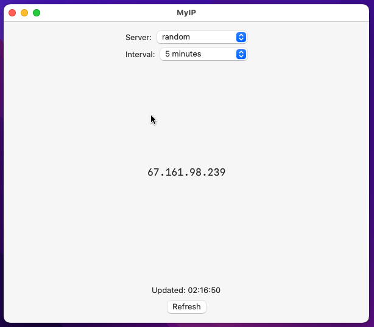

# Display Public IP Program for macOS

## Release Date
October 6, 2022

## Program License

MIT Licensed. Refer to copyright.txt and LICENSE for details.

## Program Description

This program displays the public IP for the computer.

## Features

 - Displays the IPv4 public IP address for the network the computer is connected to.
 - Supports requesting the IP address from a number of remote servers.
 - Supports automically refreshing the IP address based upon a selectable interval.
 - Supports double-clicking the IP address and right-click to copy to the clipboard.

## Usage

Build the program either with Xcode or with the Xcode command command line tool xcodebuild.
To build from the command line use the build.sh script.

Example command line build command for Intel architecture:

`xcodebuild -workspace MyIP.xcodeproj/project.xcworkspace -scheme MyIP CONFIGURATION_BUILD_DIR=build -configuration Release -arch x86_64`

## Tested Environments
 - Xcode 14.0.1
 - Swift version 5.7
 - macOS Monterey 12.6 Intel

## Notes
 - Written for macOS, iPad and iPhone. However, only tested on macOS Intel.

## Known Bugs
None.
